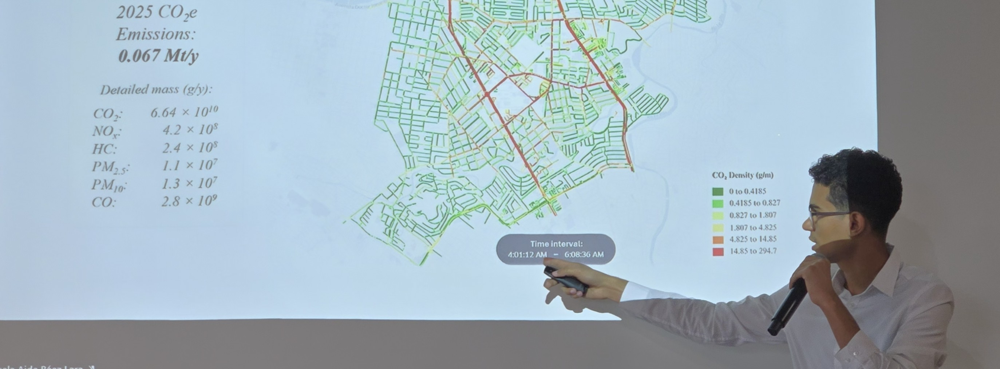

# Hello, I'm Eydan Peña

  

I'm an **Industrial Physics Engineer** specialized in **Data Science, Mathematical Modeling, and AI**, focused on building data-driven software applications, simulation-based analytical tools, and scalable ML pipelines for complex real-world systems.

My work combines **Python**, **machine learning**, **geospatial analytics**, and **simulation** to solve applied problems in mobility, sustainability, cybersecurity, environmental monitoring, and physical systems.

* 🔭 Currently working as a **Data Science Research Intern** at the **Sustainable Energy Group (SNRGY), ITESM**
* 🧠 Interested in **ML systems, geospatial Big Data, simulation, NLP, and applied AI**
* 🛰️ Experience with vehicle emissions modeling, GPS Big Data, SUHI analysis, CubeSat data pipelines, and cloud-based ML applications
* 🛠️ I enjoy turning research problems into reproducible computational tools
* 📬 Connect with me on [LinkedIn](https://linkedin.com/in/eydanvpu/)

---

## 🚀 What I Build

### 🌎 Mobility, Emissions & Geospatial Intelligence

I work on data-intensive pipelines for urban mobility and environmental modeling, including GPS processing, map-matching, routing, modal classification, traffic simulation, and high-resolution emissions estimation.

### 🤖 Machine Learning & Applied AI

I develop ML models for structured and unstructured data, including NLP models for sentiment and public safety analysis, anomaly detection workflows, and intelligent decision-support systems.

### 🛰️ Scientific & Engineering Software

I build reproducible tools for research and engineering projects, including geospatial data pipelines, satellite-data processing workflows, simulation-based models, and analytical dashboards.

---

## 🧩 Featured Work

### Sustainable Energy Group (SNRGY), ITESM

Data science and research work focused on sustainable mobility, emissions modeling, and environmental impact assessment.

* **Vehicle Emissions**: High-resolution vehicular emissions estimation for metropolitan mobility planning under the Strategic Plan 2040.
* **Massive Events**: GPS Big Data framework processing over 200M records through map-matching, routing, and modal classification to quantify mobility disruptions and environmental impacts.
* **NLP & Public Safety**: Sentiment analysis models for public safety-related data, achieving an F1-score of 0.87.

### 3U CubeSat Data Pipeline

Led the data science component of a 3U CubeSat mission for Urban Heat Island monitoring, building a geospatial processing pipeline to analyze SUHI anomalies across the Monterrey Metropolitan Area using a 30 m grid.

### Hackathons & Applied ML Projects

* **Hack IDM x SAP**: AI-powered SIEM and MLOps pipeline on SAP HANA and Azure for cybersecurity anomaly detection.
* **Datathon 2026 – Hey Banco**: ML-based personalization engine for adaptive mobile banking experiences.
* **NASA International Space Apps Challenge**: Cloud-based ML application combining satellite, ground-sensor, and weather data for air quality forecasting.
* **Hack FEMSA Ventures**: YOLOv8-based computer vision platform for planogram compliance verification.

---

## 🛠️ Tech Stack

<table>
  <tr>
    <td><b>Data Science & ML</b></td>
    <td>
      
      
      
      
      
      
    </td>
  </tr>
  <tr>
    <td><b>Geospatial & Simulation</b></td>
    <td>
      
      
      
      
    </td>
  </tr>
  <tr>
    <td><b>Software & Platforms</b></td>
    <td>
      
      
      
      
      
      
    </td>
  </tr>
  <tr>
    <td><b>Engineering & Reporting</b></td>
    <td>
      
      
      
      
    </td>
  </tr>
</table>

---

## 📌 Current Focus

* Building scalable data pipelines for mobility and environmental analytics
* Applying ML and statistical modeling to real-world decision-making systems
* Developing reproducible research software for geospatial and simulation-based projects
* Exploring AI systems for cybersecurity, intelligent monitoring, and scientific computing

---

## 📫 Contact

* LinkedIn: [linkedin.com/in/eydanvpu](https://linkedin.com/in/eydanvpu/)
* GitHub: [github.com/vladimirp07](https://github.com/vladimirp07)
* Email: [eydan.vladimir.pena@gmail.com](mailto:eydan.vladimir.pena@gmail.com)
