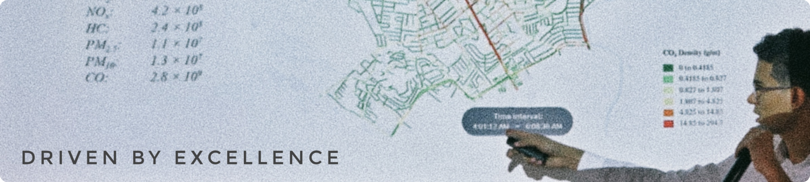

  

# Hello, I'm Eydan Peña 👋
### Industrial Physics Engineer | Data Scientist & AI Developer

I'm an **Engineer** specialized in **Data Science, Mathematical Modeling, and AI**, focused on building data-driven software applications, simulation-based analytical tools, and scalable ML pipelines for complex real-world systems.

My work combines **Python**, **machine learning**, **geospatial analytics**, and **simulation** to solve applied problems in mobility, sustainability, cybersecurity, environmental monitoring, and physical systems.

* Currently working as a **Data Science Research Intern** at the **Sustainable Energy Group (SNRGY), ITESM**
* Interested in **ML systems, geospatial Big Data, simulation, NLP, and applied AI**
* Experience with vehicle emissions modeling, GPS Big Data, SUHI analysis, data pipelines, and cloud-based ML applications
* I enjoy turning research problems into reproducible computational tools
* Connect with me on [LinkedIn](https://linkedin.com/in/eydanvpu/)

---

## 🚀 What I Build

* **🌎 Mobility, Emissions & Geospatial Intelligence**: I work on data-intensive pipelines for urban mobility and environmental modeling, including GPS processing, map-matching, routing, modal classification, traffic simulation, and high-resolution emissions estimation.
* **🤖 Machine Learning & Applied AI**: I develop ML models for structured and unstructured data, including NLP models for sentiment and public safety analysis, anomaly detection workflows, and intelligent decision-support systems.
* **🛰️ Scientific & Engineering Software**: I build reproducible tools for research and engineering projects, including geospatial data pipelines, satellite-data processing workflows, simulation-based models, and analytical dashboards.

---

## 🧩 Selected Projects

Here is a selection of research and applied development projects I've worked on. Please note that while I have pinned some of my projects here, others are currently kept in private repositories or developed locally first. If you are interested in any of them, please feel free to reach out!

* **Vehicle Emissions Modeling (SNRGY, ITESM)**: High-resolution emissions estimation for metropolitan mobility planning.
* **GPS Big Data Framework (SNRGY, ITESM)**: Processed 200M+ GPS records through map-matching and modal classification.
* **3U CubeSat Data Pipeline**: Built a geospatial pipeline for Urban Heat Island monitoring (30m grid).
* **Cybersecurity SIEM (Hack IDM x SAP)**: AI-powered SIEM & MLOps pipeline on SAP HANA and Azure.
* **Banking Personalization (Datathon – Hey Banco)**: ML-based adaptive personalization engine.
* **Air Quality Forecasting (NASA Space Apps)**: Cloud-based ML forecasting using satellite and weather data.
* **Planogram Compliance (Hack FEMSA)**: YOLOv8 computer vision platform for product placement.

---

## 🛠️ Tech Stack

* **Data Science & ML**:      
* **Geospatial & Simulation**:    
* **Software & Platforms**:      
* **Engineering & Tools**:    

---

## 📌 Current Focus

* Finalizing two scientific publications focused on sustainable mobility and vehicular emissions modeling at **SNRGY**
* Exploring advanced route optimization, map-matching, and route completion algorithms
* Documenting and migrating my local codebases to GitHub to share my research tools and projects
* Learning MLOps and DevOps best practices to become a more well-rounded developer

---

## 📫 Contact

* LinkedIn: [linkedin.com/in/eydanvpu](https://linkedin.com/in/eydanvpu/)
* Email: [eydan.vladimir.pena@gmail.com](mailto:eydan.vladimir.pena@gmail.com)

